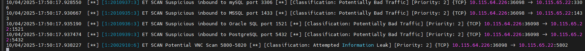

# Домашнее задание к занятию "`Защита сети`" - `Иванов Сергей`

***Все используемые IP адреса и сети тестовые. После выполнения задания - удалены.***

## Подготовка к выполнению заданий
1. Подготовка защищаемой системы:
   * установите **Suricata**,
   * установите **Fail2Ban**.

2. Подготовка системы злоумышленника: установите nmap и thc-hydra либо скачайте и установите Kali linux.
Обе системы должны находится в одной подсети.

## ✅  Задание 1

Проведите разведку системы и определите, какие сетевые службы запущены на защищаемой системе:

```bash
sudo nmap -sA < ip-адрес >
sudo nmap -sT < ip-адрес >
sudo nmap -sS < ip-адрес >
sudo nmap -sV < ip-адрес >
```

По желанию можете поэкспериментировать с опциями: https://nmap.org/man/ru/man-briefoptions.html.

*В качестве ответа пришлите события, которые попали в логи Suricata и Fail2Ban, прокомментируйте результат.*

### Ответ:

### 1. Сканируем вредоносную активность c использованием команды sudo nmap -sS < ip-адрес >
На атакуемую машину установлен **Suricata**
С атакующей машины запущен **nmap** сканирование портов.

На машине с **Suricata** наблюдаем попытки сканирования портов


 
 на изображении мы видим что с ip адреса *10.115.64.226* осуществлялось сканирования портов.
 Согласно правилам настройки suricata, это сканирование идентифицировало попытки сканирования портов 3305, 1433, 1521б 2800-5820, 5432.

С атакующей машине показаны открытые порты:


Из результата вывода видим, что на атакуемой машине открыт порт 22.

Теперь попробуем подобрать пароль

### 2. Сканируем вредоносную активность c использованием команды  sudo nmap -sA < ip-адрес >

Результат вывода на машине злоумышленника


Злоумышленник выполнил **ACK-сканирование** (-sA) с помощью Nmap и получил следующий результат:

* Все 1000 просканированных TCP-портов на хосте 10.115.65.22 оказались в состоянии **«unfiltered»** (непрофильтрованные), то есть на каждый отправленный ACK-пакет пришёл RST-ответ от хоста.
* Это означает, что на хосте **не обнаружено работающего stateful firewall (например, iptables с правилами DROP/REJECT)** — трафик не блокируется на уровне фильтрации.
* Однако **ACK-сканирование не позволяет определить, открыты порты или нет** — оно предназначено **только для картографирования правил фаервола**.
* Вывод: **фаервол, скорее всего, отсутствует или пропускает трафик**, но **состояние портов (открыт/закрыт) остаётся неизвестным**.

***Итог**: злоумышленник выяснил, что целевой хост не фильтрует входящие ACK-пакеты, что может указывать на отсутствие строгого фаервола, но не получил информации о том, какие сервисы доступны. Для этого ему нужно выполнить другие виды сканирования (например, -sS или -sT). *


На защищаемой машине, **suricata** не выявила активности.

Однако ACK-сканирование выглядит как "нормальный" RST-ответ от хоста, и сам сканер не создаёт полного TCP-соединения. Поэтому Suricata может не среагировать. 

Может ли Suricata это увидеть?

**Да, если:**
* Suricata настроена на анализ **всех сетевых пакетов** (в режиме IDS/IPS).
* Используются **правила, срабатывающие на подозрительные TCP-пакеты**, например:
    * Пакеты с необычными флагами (только ACK без предварительного handshake).
    * Потоки, характерные для сканирования портов.

### 3. Сканируем вредоносную активность c использованием команды  sudo nmap -sT < ip-адрес >

Результат вывода на машине злоумышленника


С помощью **TCP-сканирования** (-sT) злоумышленник обнаружил, что на хосте **10.115.65.22**:
* **Открыт только один порт — 22/tcp**, на котором работает **SSH-сервис**.
* Все остальные 999 просканированных портов **закрыты** (отвечают с conn-refused).
Это даёт ему **точку атаки**: попытаться подобрать учётные данные к SSH (например, брутфорсом) или воспользоваться уязвимостью в SSH-сервере.

MAC-адрес: **BC:24:11:8D:54:48**
Первые 3 байта (BC:24:11) — это **OUI (Organizationally Unique Identifier)**, присвоенный IEEE компании Proxmox Server Solutions GmbH.
Nmap содержит встроенную базу OUI и автоматически сопоставляет MAC-адрес с производителем, если сканирование выполняется в локальной сети (т.е. хост доступен на уровне L2/Ethernet).
Атакующий находится в той же LAN, что и цель. Только в этом случае Nmap может увидеть MAC-адрес ответившего устройства и определить вендора по OUI. 

**Вывод:**
Злоумышленник выяснил:

1. На целевой машине работает SSH.
2. Машина, скорее всего, — сервер на базе Proxmox VE (популярная платформа виртуализации от этой компании).
3. Это локальная цель (в той же подсети), что упрощает дальнейшие атаки.

Это типичный первый шаг разведки перед попыткой несанкционированного доступа. 

На защищаемой машине **suricata** обнаружила активность:


Из приведённого вывода Suricata можно извлечь ключевую информацию для усиления защиты вашей системы. Вот что важно знать и что делать:

#### 1. Идентификация атакующего:
* **IP-адрес злоумышленника:** 10.115.64.226
* **Целевой хост:** 10.115.65.22
* Все попытки произошли **одновременно** (в течение ~30 мс), что указывает на **автоматизированное сканирование** (например, с помощью nmap или скрипта).

Действие:
Немедленно заблокировать IP 10.115.64.226 на уровне фаервола (нiptables, nftables, или через fail2ban). 

#### 2. Цель атаки — поиск уязвимых сервисов
Злоумышленник проверяет наличие следующих **высокоуязвимых сервисов**:

|**Порт**|**Сервис**|**Риски**|
|---|--|---|
|3306|MySQL|Часто доступен без пароля или со слабыми учётными данными|
|5432|PostgreSQL|Может содержать чувствительные данные|
|1433|MSSQL|Уязвимости типа "SA brute-force", RCE|
|1521|Oracle DB|Сложная, но часто неправильно настроенная СУБД|
|5810|VNC|Прямой доступ к графическому интерфейсу → полный контроль|

**Действие**:
`Убедиться, что эти сервисы не слушают внешние интерфейсы, если они не предназначены для публичного доступа.
Проверить:`
```bash
ss -tuln | grep -E ':(3306|5432|1433|1521|5800|5801|5810|5820)'
```

#### 3. Подтверждение разведывательной фазы
Это **не атака напрямую**, а **разведка (reconnaissance)** — злоумышленник ищет «двери», через которые можно проникнуть.

**Действие:**
Это **раннее предупреждение**. Используйте его, чтобы: 

* Убедиться, что все СУБД и VNC защищены паролями.
* Отключить ненужные сервисы.
* Ограничить доступ к этим портам только доверенным IP (например, через ufw или iptables).

#### 4. Подтверждение работы Suricata
Suricata успешно сработала на правила из набора **Emerging Threats (ET)**, что означает:

* Cистема **мониторит сетевой трафик**.
* Правила обновлены и актуальны.

**Действие:**
Регулярно обновляйте правила Suricata: 
```bash
sudo suricata-update
sudo systemctl reload suricata
```

#### 5. Рекомендации по защите
* Заблокировать источник:
```bash
sudo iptables -A INPUT -s 10.115.64.226 -j DROP
```
* Ограничить доступ к СУБД:
* Настроить bind-address в конфигах СУБД на 127.0.0.1, если доступ нужен только локально.
* Отключить VNC, если не используется, или замените на более безопасный способ (например, SSH + X11 forwarding).
* Настроить fail2ban для автоматической блокировки сканеров.
* Проверить логи других сервисов (SSH, MySQL и т.д.) на предмет последующих атак с этого IP.

**Вывод**
Suricata зафиксировала **классическую разведку перед атакой**. Это **важный сигнал** — есть шанс **предотвратить вторжение**, если вовремя усилить защиту целевых сервисов и заблокировать атакующего.


### 4. Сканируем вредоносную активность c использованием команды  sudo nmap -sV < ip-адрес >

Злоумышленник с помощью команды **nmap -sV** (сканирование с определением версий сервисов) получил следующую **ключевую информацию** о хосте 10.115.65.22:

* **Открыт только порт 22/tcp**, на котором работает SSH.
* **Точная версия SSH-сервера:**
    `OpenSSH 8.9p1 Ubuntu 3ubuntu0.13` (на Ubuntu Linux).
* ОС: **Linux** (уточнено через CPE: cpe:/o:linux:linux_kernel).
* Устройство, скорее всего, — сервер на базе **Proxmox** (по MAC-адресу: BC:24:11:... → Proxmox Server Solutions GmbH).

**Что это даёт злоумышленнику?**
* Возможность поиска известных уязвимостей именно в этой версии OpenSSH или пакета Ubuntu.
* Понимание, что система — Linux-сервер, что помогает при планировании атаки (например, брутфорс учётных данных, эксплуатация уязвимостей ядра и т.д.).
* Уверенность, что **других открытых сервисов нет** (из 1000 просканированных портов только SSH активен).
`Это — точная разведка перед атакой: теперь злоумышленник может сфокусироваться на взломе SSH (подбор пароля, использование уязвимостей и т.п.). `

На защищаемой машине **suricata** обнаружила активность:



Описание деййствий атакующего и порядок действий как описано в п.4

## ✅ Задание 2

Проведите атаку на подбор пароля для службы SSH:

```bash
hydra -L users.txt -P pass.txt < ip-адрес > ssh
```

1. Настройка hydra:
     * создайте два файла: **users.txt** и **pass.txt**;
     * в каждой строчке первого файла должны быть имена пользователей, второго — пароли. В нашем случае это могут быть случайные строки, но ради эксперимента можете добавить имя и пароль существующего пользователя.

Дополнительная информация по hydra: https://kali.tools/?p=1847.

2. Включение защиты **SSH** для **Fail2Ban**:
    * открыть файл ***/etc/fail2ban/jail.conf***,
    * найти секцию **ssh**,
    * установить **enabled** в **true**.
Дополнительная информация по Fail2Ban:https://putty.org.ru/articles/fail2ban-ssh.html.

*В качестве ответа пришлите события, которые попали в логи Suricata и Fail2Ban, прокомментируйте результат.
*
### Ответ:

Предлагаю запускать hydra с дополнительными ключами:

`-t 1` - в один поток (т.к. из множественных запосов сервер может скинуть соединение, что приведет к неправдоподобным результатам)

`-f` - завершить сканирование при совпадении логина и пароля

Создан файл user.txt и passw.txt c тестовыми логинами и паролями


### 1. Анализируем вредоносную активность при помощи "file2ban" (логин и пароль отсутсвует в файлах злоумышленника)


Злоумышленник **не смог подобрать учётные данные** к SSH-сервису на хосте 10.115.65.22.

**Причина неудачи:**
Hydra прервала атаку **из-за слишком большого числа ошибок подключения** (too many connection errors). Это обычно означает, что:

* SSH-сервер отклонял или сбрасывал соединения (fail2ban),
* Сетевые проблемы (пакеты терялись),
* Или сервер временно перестал отвечать.

**Итог:**
* Ни одна пара логин/пароль не была проверена успешно.
* Атака прервана на ранней стадии — из 24 запланированных попыток выполнено только 5.


Проанализировав логи, можно сделать однозначный вывод: на сервере test-netology-2 **проводилась атака методом перебора (brute-force)** через SSH.

Что происходило?
С IP-адреса **10.115.64.226** был совершён **массовый подбор учётных данных SSH**, целью которого было получить несанкционированный доступ к серверу.

Атакующий:

Подключался множеством параллельных сессий
Пробовал вход под несуществующими пользователями, такими как:
* admin
* user
* superuser
Для каждого пользователя — несколько попыток ввода неверного пароля
Пример из лога:

```bash
Invalid user admin from 10.115.64.226 port 35206
Failed password for invalid user admin from 10.115.64.226 port 35222 ssh2
```

Это классическая **SSH-брутфорс атака**.

Характеристики атаки
**Источник:** 10.115.64.226
**Цель:** Сервер test-netology-2 на порту 22 (SSH)
**Метод:** Перебор имён пользователей и паролей
**Популярные логины:**
 * admin
 * user
 * superuser
**Количество попыток:** Множество за короткое время (в течение нескольких секунд)
**Результат: Все попытки провалились (пользователи не существуют)**

Также система начала **ограничивать количество подключений:**

```bash
error: beginning MaxStartups throttling
drop connection #13 from [10.115.64.226]:35354 on [10.115.65.22]:22 past MaxStartups
```
— это означает, что SSH-демон (sshd) сам пытался защититься, ограничивая число одновременных подключений от одного IP.

Чтобы предотвратить подобные атаки в будущем:

1. Оставить только нужных пользователей;
2. Удалить или переименовать стандартных пользователей вроде admin, user.
3. Отключить вход по паролю.
4. Использовать SSH-ключи

    ```bash
    # В /etc/ssh/sshd_config
    PasswordAuthentication no
    PubkeyAuthentication yes
    ```

5. Изменить порт SSH с 22 на другой
```bash
# В /etc/ssh/sshd_confi
Port 2222  # или любой другой
```
    — это не спасёт от целевой атаки, но снизит шум от автоматических сканеров.
6. Ограничь доступ по IP (если возможно)

Добавлен логин **testuser** в файл user.txt


Добавлен пароль **pastest** в файл user.txt


### 2. Анализируем вредоносную активность при отключенном "file2ban" (логин и пароль есть в файлах злоумышленника)


Злоумышленник **успешно** подобрал учётные данные для SSH-доступа к хосту **10.115.65.22**:

**Логин**: testuser
**Пароль**: pastest
**Атака завершилась успешно** — найдена валидная пара логин/пароль, что даёт злоумышленнику полноправный доступ к системе через SSH.

Это **критическая компрометация**: злоумышленник теперь может **выполнять команды, красть данные, устанавливать бэкдоры и перемещаться по сети**. 

suricata зафиксировала множественные попытки перебора

```bash
sudo tail -f /var/log/suricata/fast.log
```


```bash
tail -f /var/log/auth.log
```


Злоумышленник успешно авторизовался на атакуемой машине.


